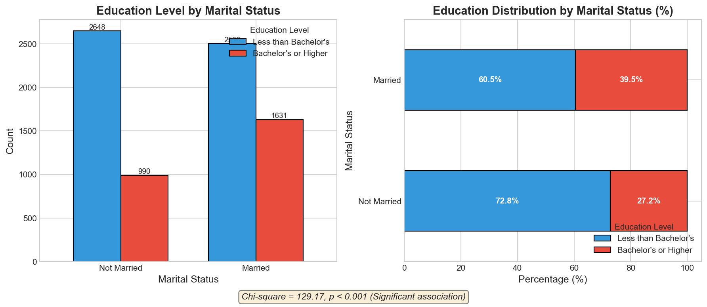
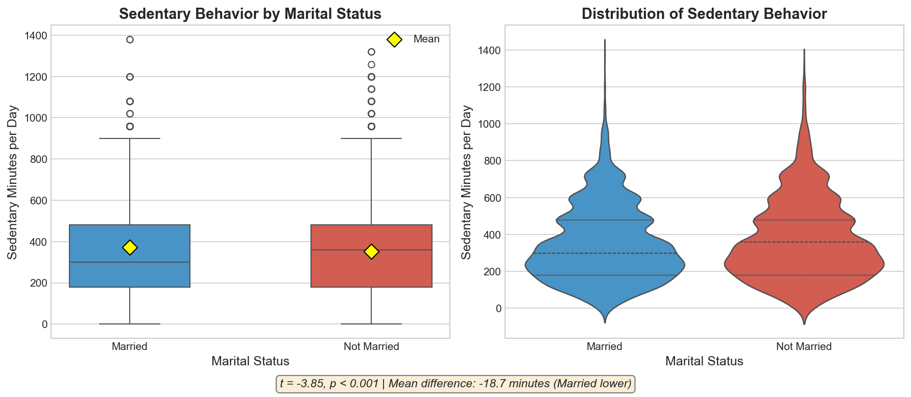
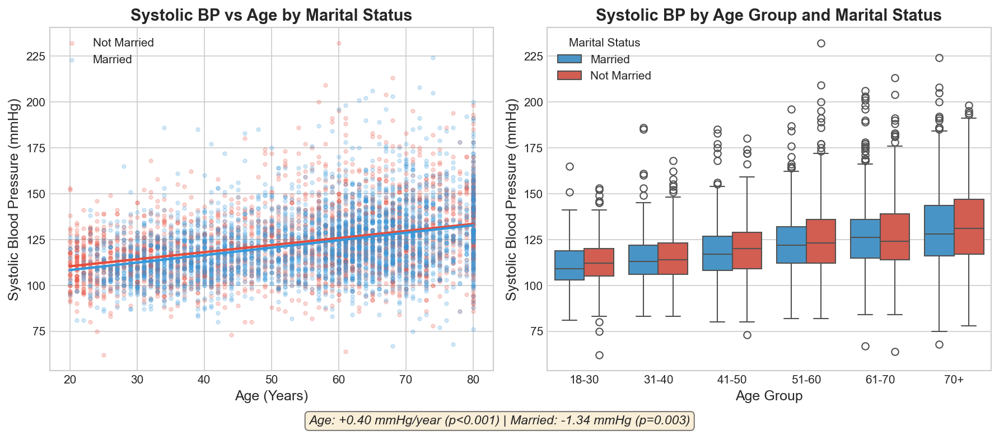
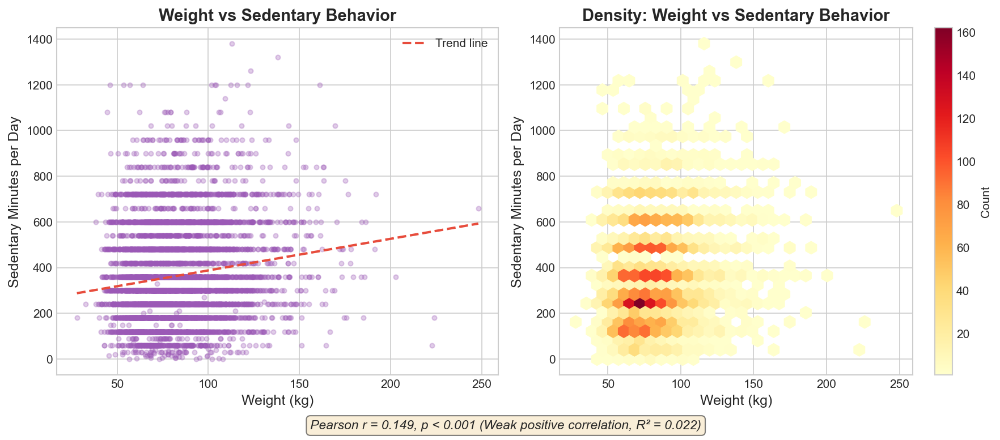
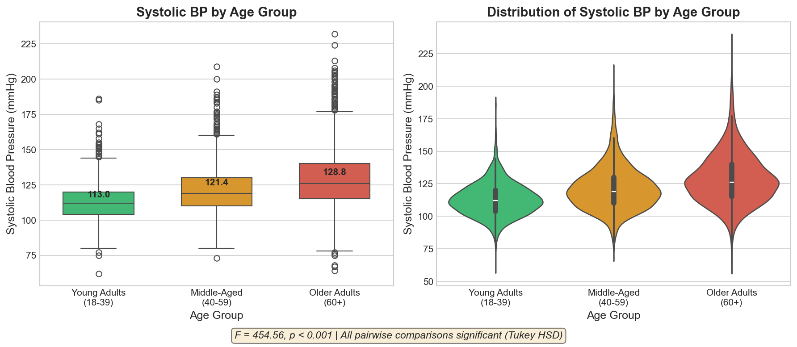

# NHANES 2021-2023 Inferential Statistics Analysis - Answers

### Data Sources Used
- **DEMO_L.xpt**: Demographics data (n=11,933)
- **BPXO_L_boodpressure.xpt**: Blood pressure measurements (n=7,801)
- **PAQ_L_physicalactivity.xpt**: Physical activity questionnaire (n=8,153)
- **BMX_L_bodymeasures.xpt**: Body measurements (n=8,860)

### Data Preparation Notes
- **Marital Status (DMDMARTZ)**: Recoded to binary - Married (1) vs. Not Married (0, including widowed, divorced, separated, never married, and living with partner)
- **Education Level (DMDEDUC2)**: Recoded to binary - Bachelor's degree or higher (5) vs. Less than bachelor's (1-4)
- **Sedentary Behavior (PAD680)**: Cleaned by removing placeholder values 7777 and 9999
- **Weight**: Used measured weight (BMXWT) since self-reported weight (WHD020) was not in the provided dataset

---

## Question 1: Association between Marital Status and Education Level

**Research Question**: Is there an association between marital status (married or not married) and education level (bachelor's degree or higher vs. less than a bachelor's degree)?

### Statistical Test Used
**Chi-Square Test of Independence** - This test is appropriate because both variables are categorical with two levels each, and we are testing whether there is a relationship between them.

### Results

**Contingency Table:**

|                | Less than Bachelor's | Bachelor's or Higher |
|----------------|---------------------|---------------------|
| Not Married    | 2,648               | 990                 |
| Married        | 2,503               | 1,631               |

**Statistical Output:**
- Chi-square statistic: 129.17
- Degrees of freedom: 1
- **P-value: < 0.001**

### Visualization

### Interpretation

**We REJECT the null hypothesis** (p < 0.001).

There is a **statistically significant association** between marital status and education level. Looking at the proportions:

- Among **Not Married** individuals: 72.8% have less than a bachelor's degree, 27.2% have a bachelor's or higher
- Among **Married** individuals: 60.6% have less than a bachelor's degree, 39.5% have a bachelor's or higher

**Conclusion**: Married individuals are more likely to have a bachelor's degree or higher compared to non-married individuals. This could reflect various socioeconomic factors where education and marriage decisions may be interconnected (e.g., career stability, delayed marriage for education, or shared socioeconomic backgrounds in partner selection).

---

## Question 2: Difference in Sedentary Behavior by Marital Status

**Research Question**: Is there a difference in the mean sedentary behavior time between those who are married and those who are not married?

### Statistical Test Used
**Welch's t-test (Independent Samples t-test with unequal variances)** - This test is appropriate because we are comparing means of a continuous variable (sedentary minutes) between two independent groups (married vs. not married). Welch's version was used because Levene's test indicated unequal variances (p < 0.001).

### Results

**Descriptive Statistics:**

| Group        | N     | Mean (min) | Std Dev | Median (min) |
|--------------|-------|------------|---------|--------------|
| Married      | 4,106 | 353.29     | 203.88  | 300          |
| Not Married  | 3,603 | 371.96     | 219.53  | 360          |

**Statistical Output:**
- t-statistic: -3.85
- **P-value: 0.000118**
- Mean difference: -18.67 minutes (Married - Not Married)
- Effect size (Cohen's d): -0.088 (small effect)

### Visualization

### Interpretation

**We REJECT the null hypothesis** (p < 0.001).

There is a **statistically significant difference** in sedentary behavior between married and non-married individuals. On average, married individuals spend about **18.67 fewer minutes** per day in sedentary activities compared to non-married individuals.

However, the effect size is small (Cohen's d = -0.088), indicating that while the difference is statistically significant (likely due to the large sample size), the **practical significance is limited**. The difference of about 19 minutes may not be clinically meaningful.

**Conclusion**: While married individuals do report slightly less sedentary time, the difference is minimal from a practical standpoint. This small difference could be attributed to lifestyle factors associated with marriage (e.g., household responsibilities, activities with spouse/family).

---

## Question 3: Effect of Age and Marital Status on Systolic Blood Pressure

**Research Question**: How do age and marital status affect systolic blood pressure?

### Statistical Tests Used
1. **Multiple Linear Regression** - To assess the independent effects of age (continuous) and marital status (categorical) on systolic blood pressure (continuous)
2. **ANCOVA (Analysis of Covariance)** - To test main effects and examine if there's an interaction

### Results

**Sample size**: 5,838

**Descriptive Statistics:**

| Group        | N     | Mean SBP (mmHg) | Std Dev |
|--------------|-------|-----------------|---------|
| Married      | 3,186 | 122.61          | 18.04   |
| Not Married  | 2,652 | 122.87          | 18.77   |

**Multiple Linear Regression Output:**

| Variable    | Coefficient | Std Error | t-value | P-value |
|-------------|-------------|-----------|---------|---------|
| Constant    | 102.16      | 0.764     | 133.76  | < 0.001 |
| Age         | 0.395       | 0.013     | 30.11   | < 0.001 |
| Married     | -1.342      | 0.451     | -2.98   | 0.003   |

- R-squared: 0.134 (13.4% of variance explained)

**Interaction Effect**: Not significant (p = 0.416), meaning the effect of age on blood pressure is similar for married and non-married individuals.

### Visualization

### Interpretation

**Age Effect** (p < 0.001):
- For each additional year of age, systolic blood pressure increases by approximately **0.40 mmHg**
- This is consistent with well-established medical literature on age-related increases in blood pressure

**Marital Status Effect** (p = 0.003):
- Married individuals have systolic blood pressure that is about **1.34 mmHg lower** than non-married individuals, after controlling for age
- While statistically significant, this is a relatively small clinical difference

**Conclusion**: Age is the dominant factor affecting systolic blood pressure, explaining most of the variance. Being married is associated with slightly lower blood pressure, which aligns with research suggesting health benefits of marriage (social support, lifestyle factors). However, the marital status effect, while significant, is modest in magnitude.

---

## Question 4: Correlation between Weight and Sedentary Behavior

**Research Question**: Is there a correlation between self-reported weight and minutes of sedentary behavior?

### Statistical Test Used
**Pearson Correlation** - This test is appropriate for examining the linear relationship between two continuous variables. Spearman correlation was also calculated for robustness.

### Results

**Sample size**: 6,201

**Descriptive Statistics:**

| Variable          | Mean   | Std Dev | Min   | Max     |
|-------------------|--------|---------|-------|---------|
| Weight (kg)       | 82.90  | 22.47   | 27.9  | 248.2   |
| Sedentary (min)   | 364.33 | 207.93  | 0     | 1,380   |

**Correlation Results:**

| Test      | Coefficient | P-value  |
|-----------|-------------|----------|
| Pearson r | 0.149       | < 0.001  |
| Spearman  | 0.142       | < 0.001  |

- Coefficient of Determination (R²): 0.022 (2.2% of variance explained)

### Visualization

### Interpretation

**The correlation is STATISTICALLY SIGNIFICANT** (p < 0.001).

There is a **weak positive correlation** (r = 0.149) between weight and sedentary behavior. This means:
- Higher weight is associated with more minutes of sedentary behavior
- However, the relationship is weak - weight explains only about 2.2% of the variance in sedentary time

**Conclusion**: While there is a statistically significant positive relationship between weight and sedentary behavior, the correlation is weak. This suggests that while heavier individuals tend to be slightly more sedentary, many other factors influence sedentary behavior. The bidirectional nature of this relationship should also be considered - sedentary behavior may contribute to weight gain, and higher weight may make physical activity more difficult.

---

## Question 5: Creative Analysis - Systolic Blood Pressure Across Age Groups

**Research Question**: Is there a difference in systolic blood pressure across age groups (Young Adults 18-39, Middle-Aged 40-59, Older Adults 60+)?

### Rationale for Test Selection
I chose **One-Way ANOVA** because:
1. We are comparing means of a continuous variable (systolic blood pressure) across more than two independent groups (three age categories)
2. ANOVA allows us to test whether any group differs from the others
3. Post-hoc tests can then identify which specific groups differ

### Results

**Sample size**: 6,101

**Descriptive Statistics by Age Group:**

| Age Group             | N     | Mean SBP (mmHg) | Std Dev |
|-----------------------|-------|-----------------|---------|
| Young Adults (18-39)  | 1,746 | 112.98          | 12.62   |
| Middle-Aged (40-59)   | 1,680 | 121.37          | 16.64   |
| Older Adults (60+)    | 2,675 | 128.76          | 19.66   |

**ANOVA Results:**
- F-statistic: 454.56
- **P-value: < 0.001**
- Effect size (Eta-squared): 0.130 (12.97% of variance explained - medium to large effect)

**Post-hoc Analysis (Tukey's HSD):**

| Comparison                           | Mean Diff (mmHg) | P-value | Significant? |
|--------------------------------------|------------------|---------|--------------|
| Middle-Aged vs. Older Adults         | 7.39             | < 0.001 | Yes          |
| Middle-Aged vs. Young Adults         | -8.40            | < 0.001 | Yes          |
| Older Adults vs. Young Adults        | -15.79           | < 0.001 | Yes          |

### Visualization

### Interpretation

**We REJECT the null hypothesis** (p < 0.001).

There are **highly significant differences** in systolic blood pressure across the three age groups. All pairwise comparisons are statistically significant:

1. **Young Adults** have the lowest average systolic BP (112.98 mmHg)
2. **Middle-Aged** adults have intermediate BP (121.37 mmHg) - about 8.4 mmHg higher than young adults
3. **Older Adults** have the highest average BP (128.76 mmHg) - about 15.8 mmHg higher than young adults

The effect size (η² = 0.13) indicates a **medium to large effect**, meaning age group membership explains a substantial portion of the variation in blood pressure.

**Conclusion**: Age is a strong predictor of systolic blood pressure, with clear increases across life stages. This finding has important public health implications:
- Young adults generally maintain healthy blood pressure levels
- Blood pressure monitoring becomes increasingly important with age
- Interventions to prevent hypertension should target middle-aged adults before BP elevates further

---

## Summary of All Findings

| Question | Test | Key Finding | P-value | Effect Size | Practical Significance |
|----------|------|-------------|---------|-------------|----------------------|
| Q1 | Chi-Square | Association between marriage & education | < 0.001 | - | Moderate |
| Q2 | t-test | Married have less sedentary time | < 0.001 | d = -0.09 | Small |
| Q3 | Regression | Age increases BP; Marriage slightly lowers BP | < 0.001 | R² = 0.13 | Age: Large; Marriage: Small |
| Q4 | Correlation | Weak positive correlation weight-sedentary | < 0.001 | r = 0.15 | Small |
| Q5 | ANOVA | BP increases significantly across age groups | < 0.001 | η² = 0.13 | Large |

### Key Takeaways

1. **Age is the strongest predictor** of systolic blood pressure in this dataset, with clear increases across life stages
2. **Marriage is associated with** higher education levels and slightly better health metrics (less sedentary time, lower BP), though effect sizes are small
3. **Weight and sedentary behavior** are weakly but significantly correlated, suggesting complex relationships between lifestyle factors
4. **Statistical significance vs. practical significance**: Several findings, while statistically significant, have small effect sizes - this is common in large population studies and highlights the importance of interpreting results in clinical context

---

*Analysis conducted using Python with pandas, scipy, and statsmodels libraries.*
