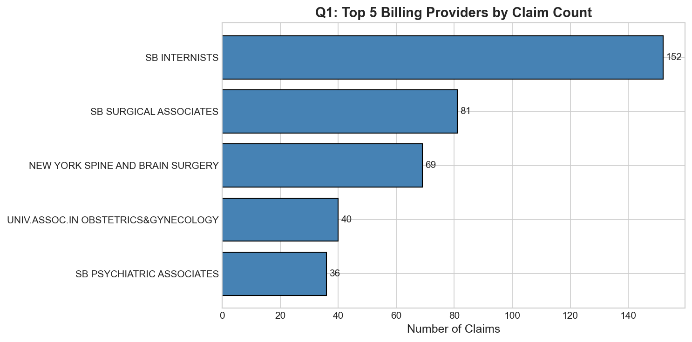
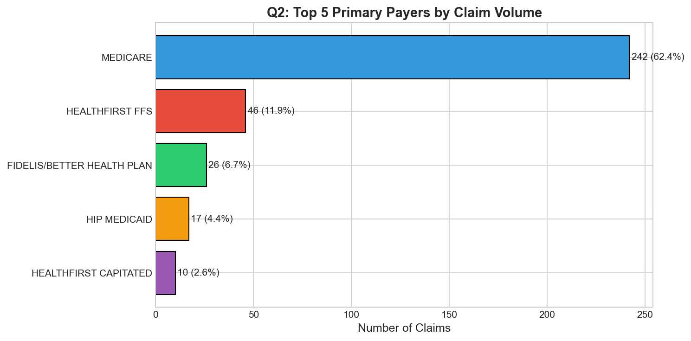
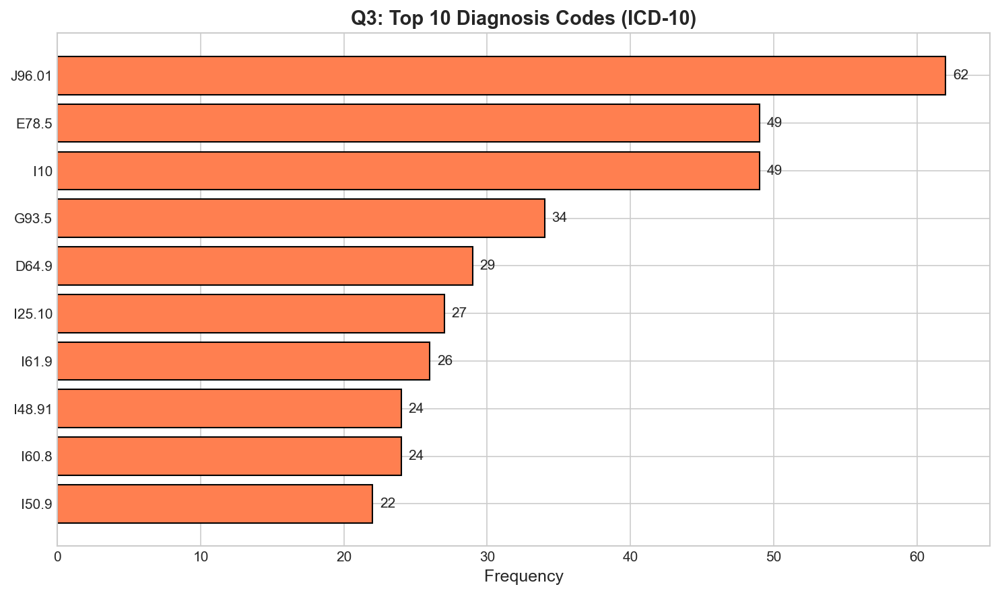
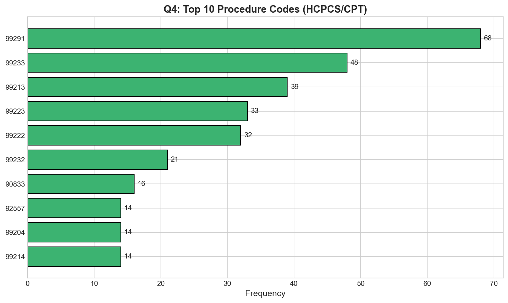
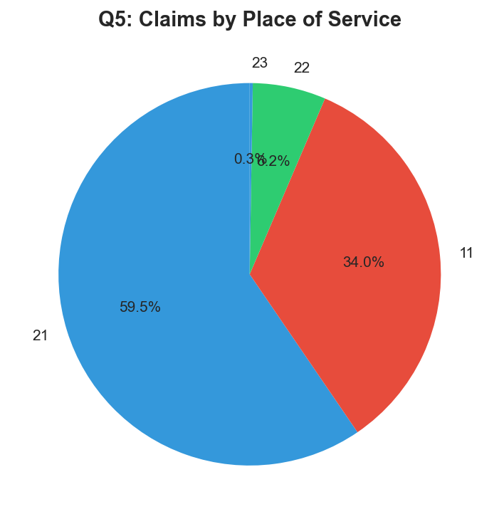
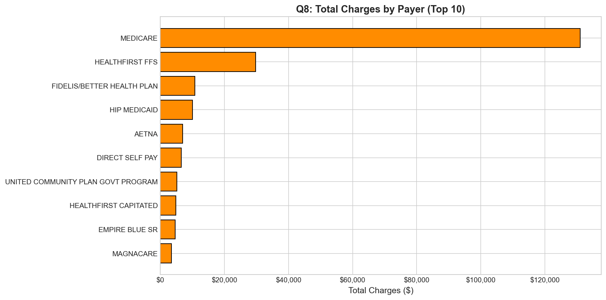
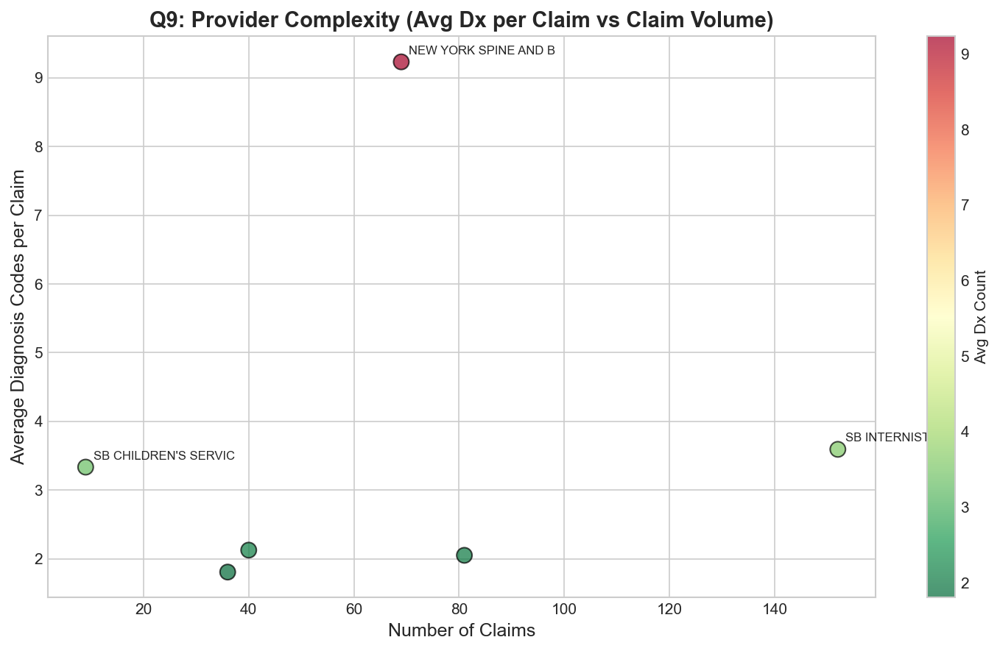

# Healthcare Claims Data Analysis - Answers

### Data Files Used
- **STONYBRK_20240531_HEADER.csv**: 388 claims, 43 columns
- **STONYBRK_20240531_LINE.csv**: 520 service lines, 28 columns
- **STONYBRK_20240531_CODE.csv**: 1,536 diagnosis codes, 9 columns

---

## Part 1: Data Exploration

### Key Observations

| Metric | Value |
|--------|-------|
| Unique Claims | 388 |
| Date Range | Sept 25, 2023 - May 29, 2024 |
| Avg Service Lines per Claim | 1.34 |
| Avg Diagnosis Codes per Claim | 3.96 |

**Observations**:
- The dataset spans approximately 8 months of claims data
- Most claims have only 1-2 service lines, indicating relatively straightforward billing
- Claims have nearly 4 diagnosis codes on average, suggesting moderate case complexity
- The relational structure links claims (HEADER) to procedures (LINE) and diagnoses (CODE) through `ProspectiveClaimId`

---

## Part 2: Relational Data Analysis

### Question 1: Top 5 Billing Providers by Claim Count

| Provider Name | NPI | Claim Count |
|--------------|-----|-------------|
| SB INTERNISTS | 1821035601 | 152 |
| SB SURGICAL ASSOCIATES | 1063468536 | 81 |
| NEW YORK SPINE AND BRAIN SURGERY | 1154376309 | 69 |
| UNIV.ASSOC.IN OBSTETRICS&GYNECOLOGY | 1538114723 | 40 |
| SB PSYCHIATRIC ASSOCIATES | 1437105905 | 36 |

**Interpretation**: SB Internists dominates the claim volume with 152 claims (39% of total), which is typical for an internal medicine group handling general patient care. Surgical Associates and Spine & Brain Surgery follow, indicating significant procedural volume at the hospital.

---

### Question 2: Payer Mix Analysis

| Payer | Claims | Percentage |
|-------|--------|------------|
| MEDICARE | 242 | 62.4% |
| HEALTHFIRST FFS | 46 | 11.9% |
| FIDELIS/BETTER HEALTH PLAN | 26 | 6.7% |
| HIP MEDICAID | 17 | 4.4% |
| HEALTHFIRST CAPITATED | 10 | 2.6% |

**Interpretation**: Medicare is the dominant payer at 62.4% of claims, which is common for academic medical centers serving older populations. Medicaid-related payers (Healthfirst, Fidelis, HIP) collectively account for about 25% of claims, reflecting the hospital's role in serving underserved populations. Commercial payers are notably underrepresented in this sample.

---

### Question 3: Top 10 Diagnosis Codes

| ICD-10 Code | Description | Frequency |
|-------------|-------------|-----------|
| J96.01 | Acute respiratory failure with hypoxia | 62 |
| E78.5 | Hyperlipidemia, unspecified | 49 |
| I10 | Essential (primary) hypertension | 49 |
| G93.5 | Compression of brain | 34 |
| D64.9 | Anemia, unspecified | 29 |
| I25.10 | Atherosclerotic heart disease | 27 |
| I61.9 | Nontraumatic intracerebral hemorrhage, unspecified | 26 |
| I48.91 | Atrial fibrillation, unspecified | 24 |
| I60.8 | Other nontraumatic subarachnoid hemorrhage | 24 |
| I50.9 | Heart failure, unspecified | 22 |

**Interpretation**: The top diagnosis codes reveal a patient population with:
- **Critical illness**: Acute respiratory failure (J96.01) is the most common code
- **Cardiovascular disease**: Hypertension, heart disease, heart failure, and atrial fibrillation are prevalent
- **Neurological conditions**: Brain compression, intracerebral hemorrhage, and subarachnoid hemorrhage appear frequently, consistent with the Spine & Brain Surgery provider presence
- **Chronic conditions**: Hyperlipidemia and anemia are common comorbidities

---

### Question 4: Top 10 Procedure Codes

| HCPCS | Description | Count |
|-------|-------------|-------|
| 99291 | Critical Care, Initial First Hour | 68 |
| 99222 | Initial Hospital Care, Level 2 | 30 |
| 99233 | Subsequent Hospital Care, Level 3 | 45 (combined) |
| 99223 | Initial Hospital Care, Level 3 | 24 |
| 99213 | Office/Outpatient Visit, Level 3 | 34 (combined) |
| 90833 | Psychotherapy with E&M, 30 min | 16 |
| 92557 | Comprehensive Audiometry | 14 |
| 99442 | Telephone Services, 11-20 min | 13 |

**Interpretation**: The procedure mix shows:
- **High acuity care**: Critical care (99291) is the most common procedure, aligning with the respiratory failure diagnoses
- **Inpatient E&M**: Initial and subsequent hospital care codes dominate, consistent with the "INPATIENT" place of service majority
- **Specialty services**: Psychotherapy and audiometry indicate diverse specialty care
- **Telehealth**: Telephone services represent modern care delivery models

---

### Question 5: Place of Service Analysis

| Place of Service | Claims | Percentage |
|------------------|--------|------------|
| 21 - Inpatient Hospital | 231 | 59.5% |
| 11 - Doctor's Office | 132 | 34.0% |
| 22 - Outpatient Hospital | 24 | 6.2% |
| 23 - Emergency Room | 1 | 0.3% |

**Interpretation**: Nearly 60% of claims are for inpatient hospital services, consistent with the critical care and surgical provider mix. About one-third are office visits, representing outpatient follow-ups and routine care. The low ER claim count (0.3%) suggests this sample focuses on scheduled/admitted care rather than emergency services.

---

## Part 3: Advanced Analysis with Joins

### Question 6: Claims with High Service Line Counts (5+ Lines)

| Claim ID | Provider | Lines | Total Charges |
|----------|----------|-------|---------------|
| 36794825 | SB CHILDREN'S SERVICE | 7 | $1,163 |
| 36668119 | UNIV.ASSOC.IN OBSTETRICS&GYNECOLOGY | 6 | $1,030 |
| 36740402 | UNIV.ASSOC.IN OBSTETRICS&GYNECOLOGY | 6 | $945 |
| 36710175 | UNIV.ASSOC.IN OBSTETRICS&GYNECOLOGY | 5 | $873 |
| 36757684 | UNIV.ASSOC.IN OBSTETRICS&GYNECOLOGY | 5 | $873 |

**Interpretation**: Only 5 claims (1.3%) have 5 or more service lines. OB/GYN accounts for 4 of these, likely representing comprehensive prenatal or postpartum visits that include multiple bundled services. The Children's Service claim with 7 lines suggests a complex pediatric encounter.

---

### Question 7: Diagnosis Codes Associated with CPT 99291 (Critical Care)

| ICD-10 Code | Description | Frequency |
|-------------|-------------|-----------|
| J96.01 | Acute respiratory failure with hypoxia | 53 |
| G93.5 | Compression of brain | 34 |
| E78.5 | Hyperlipidemia, unspecified | 33 |
| I61.9 | Intracerebral hemorrhage | 26 |
| D64.9 | Anemia, unspecified | 25 |

**Interpretation**: Critical care services (99291) are most commonly associated with:
- **Respiratory failure** (J96.01) - the primary reason for critical care in 78% of 99291 claims
- **Neurological emergencies** - brain compression and hemorrhage codes reflect the neurosurgical patient population
- **Chronic comorbidities** - hyperlipidemia and anemia commonly appear as secondary diagnoses on critical care claims

---

### Question 8: Total Charges by Payer

| Payer | Total Charges | Avg Charge/Claim | Claims |
|-------|---------------|------------------|--------|
| MEDICARE | $131,008 | $437 | 242 |
| HEALTHFIRST FFS | $29,794 | $408 | 46 |
| FIDELIS/BETTER HEALTH PLAN | $10,810 | $292 | 26 |
| HIP MEDICAID | $10,014 | $223 | 17 |
| AETNA | $6,930 | $1,155 | 6 |
| DIRECT SELF PAY | $6,575 | $1,096 | 6 |
| UNITED COMMUNITY PLAN | $5,175 | $862 | 5 |

**Interpretation**:
- **Medicare** generates the most revenue ($131K) due to volume
- **AETNA and Direct Self Pay** have the highest average charges per claim (~$1,100), suggesting commercial/self-pay patients may have more complex or higher-reimbursement services
- **Medicaid payers** have lower average charges ($200-400), likely reflecting lower fee schedules and service mix

---

## Part 4: Creative Analysis

### Question 9: Provider Complexity Analysis

**Research Question**: Which providers bill for the most complex cases (measured by average diagnosis codes per claim)?

| Provider | Avg Dx Codes | Claim Count |
|----------|--------------|-------------|
| NEW YORK SPINE AND BRAIN SURGERY | 9.23 | 69 |
| SB INTERNISTS | 3.59 | 152 |
| SB CHILDREN'S SERVICE | 3.33 | 9 |
| UNIV.ASSOC.IN OBSTETRICS&GYNECOLOGY | 2.13 | 40 |
| SB SURGICAL ASSOCIATES | 2.05 | 81 |
| SB PSYCHIATRIC ASSOCIATES | 1.81 | 36 |

**Interpretation**:

New York Spine and Brain Surgery stands out dramatically with an average of **9.23 diagnosis codes per claim** - more than double the next highest provider. This reflects:

1. **High case complexity**: Neurosurgical patients typically have multiple comorbidities
2. **Critical care overlap**: Many spine/brain surgery patients likely require ICU-level care
3. **Thorough documentation**: Complex procedures require comprehensive diagnosis coding for medical necessity

In contrast, Psychiatric Associates has the lowest complexity (1.81 dx/claim), which is expected since mental health visits typically focus on primary psychiatric diagnoses with fewer medical comorbidities documented.

**Recommendation**: The compliance team should focus documentation audits on high-complexity providers to ensure all diagnosis codes are properly supported.

---

## Summary of Key Findings

1. **Medicare dominates** the payer mix at 62%, with Medicaid-related plans accounting for 25%
2. **Critical care** (99291) is the most common procedure, associated primarily with respiratory failure
3. **Neurosurgical services** drive the highest case complexity (9+ diagnoses per claim)
4. **Inpatient services** represent 60% of claims, with the remaining 40% split between office and outpatient settings
5. **SB Internists** generates the highest claim volume but moderate complexity, typical for internal medicine

---

*Analysis conducted using Python with pandas, matplotlib, and seaborn.*
